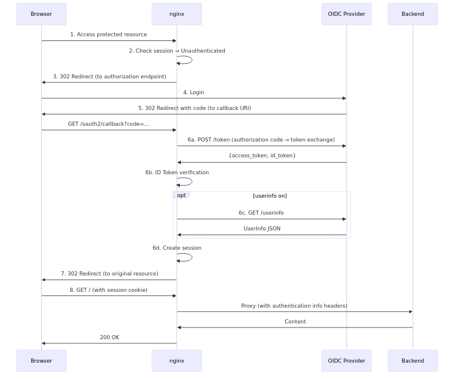

# nginx OIDC Module

Overview, key features, and quick start guide for the nginx OIDC module.

## Overview

The nginx OIDC module is a dynamic module that integrates authentication functionality based on the OpenID Connect (OIDC) protocol into nginx. When an unauthenticated user accesses a protected page, they are redirected to the login screen of an OIDC provider (Google, Azure AD, Keycloak, etc.), and after successful authentication, they are automatically returned to the original page. Authentication information is passed to backend applications through nginx variables, so no authentication implementation is needed on the backend side.

**Use case examples**:
- Add OIDC authentication to backend applications, allowing access only to logged-in users
- Forward user information (email, name, etc.) to the backend
- Switch display based on authentication state (coexistence of authenticated/unauthenticated users)
- Operate multiple OIDC providers (Google + Azure AD, etc.) on the same nginx instance
- Logout in coordination with the OIDC provider

**Scope**: This module handles **authentication** in nginx's ACCESS phase. For details on the authentication flow, see [Authentication Flow Overview](#authentication-flow-overview).

### Key Features

- **Authorization Code Flow with PKCE**: Authentication flow compliant with OAuth 2.0 / OIDC standards (S256/plain)
- **OpenID Connect Discovery**: Automatically retrieves endpoints from the issuer URL
- **Flexible Session Management**: Memory Store (for single-server environments) / Redis Store (for distributed environments)
- **JWT Token Verification**: Supports 12 algorithms/curves including RSA, ECDSA, and EdDSA
- **UserInfo Retrieval**: Fetch additional user information from the OIDC provider
- **Multi-Provider Support**: Configure multiple OIDC providers simultaneously
- **nginx Variables**: `$oidc_id_token`, `$oidc_access_token`, `$oidc_claim_*`, `$oidc_authenticated`, `$oidc_userinfo`
- **Authentication Mode Control**: `auth_oidc_mode off | verify | require` (`off`=skip authentication, `verify`=verify only (no redirect for unauthenticated users), `require`=authentication required)
- **RP-Initiated Logout**: Logout processing in coordination with the OIDC provider

### Security

- **PKCE (S256)**: Protection against Authorization Code Interception attacks
- **State Parameter**: CSRF attack protection
- **Nonce**: Replay attack protection
- **at_hash Verification**: Access token binding verification
- **JWT Signature Verification**: Token tampering detection

For details, see [SECURITY.md](docs/SECURITY.md).

For commercial version compatibility, see [COMMERCIAL_COMPATIBILITY.md](docs/COMMERCIAL_COMPATIBILITY.md).

**License**: MIT License

## Quick Start

For installation instructions, see [INSTALL.md](docs/INSTALL.md).

### Minimal Configuration

The following is a minimal complete configuration example for the OIDC module to work:

```nginx
http {
    # Session store definition (recommended: if omitted, a default memory store is automatically created)
    oidc_session_store memory_store {
        type memory;
        size 10m;
        ttl 3600;
    }

    # OIDC provider definition (required)
    oidc_provider google {
        issuer "https://accounts.google.com";
        client_id "your-client-id.apps.googleusercontent.com";
        client_secret "your-client-secret";
        redirect_uri "/oauth2/callback";
    }

    server {
        listen 80;
        server_name myapp.example.com;

        # Enable authentication for the entire server
        auth_oidc google;

        location / {
            proxy_pass http://backend;
            proxy_set_header X-User-ID $oidc_claim_sub;
        }

        # OIDC HTTP fetch proxy (required boilerplate: copy and use as-is)
        location /_oidc_http_fetch {
            internal;
            resolver 127.0.0.53 valid=300s;
            resolver_timeout 5s;
            auth_oidc off;

            proxy_pass $oidc_fetch_url;
            proxy_method $oidc_fetch_method;
            proxy_set_header Content-Type $oidc_fetch_content_type;
            proxy_set_header Content-Length $oidc_fetch_content_length;
            proxy_set_header Authorization $oidc_fetch_bearer;

            proxy_set_header Host $proxy_host;
            proxy_set_header Accept-Encoding "";
            proxy_pass_request_body on;
            proxy_max_temp_file_size 0;

            proxy_http_version 1.1;
            proxy_set_header Connection "";

            proxy_ssl_verify on;
            proxy_ssl_verify_depth 2;
            proxy_ssl_trusted_certificate /etc/ssl/certs/ca-certificates.crt;
            proxy_ssl_server_name on;
            proxy_ssl_name $proxy_host;

            proxy_connect_timeout 30s;
            proxy_send_timeout 30s;
            proxy_read_timeout 30s;
        }
    }
}
```

**Required elements**:
1. `oidc_provider`: OIDC provider configuration (issuer and client_id are required. session_store can be omitted; when omitted, a default memory store is automatically created and used)
2. `auth_oidc`: Enable authentication (at server or location level)
3. `/_oidc_http_fetch`: Internal proxy location for external HTTP requests

**Recommended elements**:
- `oidc_session_store`: Store for saving session information (when omitted, the default behavior described above applies)

The `/_oidc_http_fetch` location is **required**. Without this location, the OIDC module will not function properly.

**Note**: In the configuration example above, `ttl 3600` (1 hour) is specified, but the default value of `session_timeout` is 28800 seconds (8 hours). With the default values, `ttl` (1 hour) < `session_timeout` (8 hours), which contradicts the recommended setting (`ttl` >= `session_timeout`). As a result, even though the cookie is still valid, the server-side session expires first, causing re-authentication after 1 hour. In production environments, set `ttl` to be equal to or greater than `session_timeout` (e.g., `ttl 28800;` or reduce `session_timeout` to be equal to or less than `ttl`). For details, see [SECURITY.md](docs/SECURITY.md#session-timeout).

**More detailed configuration examples**: See [EXAMPLES.md](docs/EXAMPLES.md).

### Configuration Structure

The OIDC module configuration consists of three levels:

```nginx
http {
    # Level 1: Global settings (http context)
    oidc_session_store memory_store { ... }   # Session store definition
    oidc_provider my_provider { ... }         # Provider definition

    server {
        # Level 2: Server settings (server context)
        auth_oidc my_provider;               # Enable authentication
        auth_oidc_mode require;              # Authentication mode
        oidc_base_url "https://example.com"; # Base URL

        location / {
            # Level 3: Location settings (location context)
            auth_oidc my_provider;           # Override authentication
            auth_oidc_mode verify;           # Override mode
        }

        location /_oidc_http_fetch {
            # Required: OIDC HTTP fetch proxy
            internal;
            auth_oidc off;
            # ...
        }
    }
}
```

## Directives

For details, see [DIRECTIVES.md](docs/DIRECTIVES.md).

| Directive | Description | Context |
|---|---|---|
| `auth_oidc` | Enable OIDC authentication | http, server, location |
| `auth_oidc_mode` | Authentication mode control | http, server, location |
| `oidc_provider` | OIDC provider definition | http |
| `oidc_session_store` | Session store definition | http |
| `oidc_base_url` | Base URL for redirect URI | http, server, location |
| `oidc_status` | Status endpoint | server, location |

## Embedded Variables

For details, see [DIRECTIVES.md](docs/DIRECTIVES.md#embedded-variables).

| Variable | Description |
|----------|-------------|
| `$oidc_id_token` | OpenID Connect ID token (JWT) |
| `$oidc_access_token` | OAuth 2.0 access token |
| `$oidc_claim_*` | JWT claim values (prefix variable) |
| `$oidc_authenticated` | Authentication status flag |
| `$oidc_userinfo` | Information retrieved from the UserInfo endpoint (JSON) |

## Appendix

### Authentication Flow Overview

The OIDC module implements the OpenID Connect Authorization Code Flow.



> **Note**: To enable UserInfo retrieval (the `userinfo on` section), set `userinfo on;` within `oidc_provider`. For details, see [DIRECTIVES.md](docs/DIRECTIVES.md#userinfo).

### Standards Reference

This module complies with the following standards:

- **[OpenID Connect Core 1.0](https://openid.net/specs/openid-connect-core-1_0.html)**: Core OIDC specification
- **[OAuth 2.0 (RFC 6749)](https://datatracker.ietf.org/doc/html/rfc6749)**: OAuth 2.0 Authorization Framework
- **[OAuth 2.0 PKCE (RFC 7636)](https://datatracker.ietf.org/doc/html/rfc7636)**: Proof Key for Code Exchange
- **[OAuth 2.0 Security Best Current Practice](https://datatracker.ietf.org/doc/html/draft-ietf-oauth-security-topics)**: Security Best Practices
- **[JSON Web Token (JWT) (RFC 7519)](https://datatracker.ietf.org/doc/html/rfc7519)**: JWT Token specification
- **[JSON Web Signature (JWS) (RFC 7515)](https://datatracker.ietf.org/doc/html/rfc7515)**: JWT Signature specification
- **[JSON Web Key (JWK) (RFC 7517)](https://datatracker.ietf.org/doc/html/rfc7517)**: Public key format

**Related links**:
- [nginx OIDC Commercial Module](https://nginx.org/en/docs/http/ngx_http_oidc_module.html)
- [nginx Development Guide](https://nginx.org/en/docs/dev/development_guide.html)

## Related Documents

**Configuration & Operations**:

- [DIRECTIVES.md](docs/DIRECTIVES.md): Directives and variables reference
- [EXAMPLES.md](docs/EXAMPLES.md): Quick start and practical configuration examples
- [INSTALL.md](docs/INSTALL.md): Installation guide (prerequisites, build instructions)
- [SECURITY.md](docs/SECURITY.md): Security considerations (PKCE, HTTPS, cookie security, etc.)
- [TROUBLESHOOTING.md](docs/TROUBLESHOOTING.md): Troubleshooting (common issues, log inspection)

**Reference**:

- [JWT_SUPPORTED_ALGORITHMS.md](docs/JWT_SUPPORTED_ALGORITHMS.md): JWT supported algorithms
- [COMMERCIAL_COMPATIBILITY.md](docs/COMMERCIAL_COMPATIBILITY.md): Commercial version compatibility
