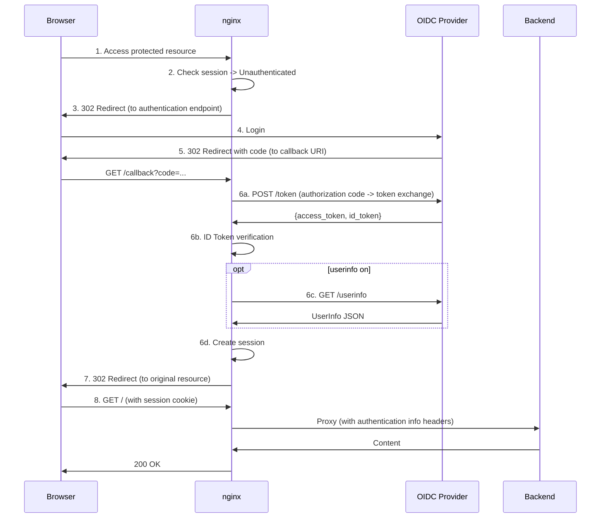

# NGINX OIDC Module

## 1. Overview

### 1.1 About This Module

The nginx OIDC module is a dynamic module that integrates authentication and authorization functionality based on the OpenID Connect (OIDC) protocol into nginx. By using this module, you can perform user authentication before requests reach backend applications while using nginx as a reverse proxy.

### 1.2 Key Features

This module provides the following features:

- **Authorization Code Flow with PKCE**: Authentication flow compliant with OAuth 2.0 / OIDC standards
  - PKCE (Proof Key for Code Exchange) support (S256/plain)
  - Security-enhanced code exchange mechanism

- **Flexible Session Management**:
  - Memory Store: Uses shared memory (for single-server environments)
  - Redis Store: Uses a Redis server (for distributed environments and high availability)

- **JWT Token Verification**:
  - Signature verification (RSA, ECDSA, EdDSA)
  - Claims verification (iss, aud, exp, iat, nbf, nonce, at_hash)
  - 11 signature algorithms supported (EdDSA supports 2 curves: Ed25519/Ed448, totaling 12 patterns)

- **UserInfo Retrieval**: Fetch additional user information from the OIDC provider

- **Multi-Provider Support**: Configure multiple OIDC providers simultaneously

- **nginx Variables**: Variables for passing authentication information to backend applications
  - `$oidc_id_token`: ID Token (JWT)
  - `$oidc_access_token`: Access token
  - `$oidc_claim_*`: JWT claims (sub, email, name, etc.)
  - `$oidc_authenticated`: Authentication status flag
  - `$oidc_userinfo`: UserInfo JSON

- **Authentication Mode Control** (`auth_oidc_mode`):
  - `off`: Disable OIDC processing
  - `verify`: Verify authentication status but do not redirect unauthenticated users
  - `require`: Redirect unauthenticated users to the authentication flow (default)

- **RP-Initiated Logout**: Logout processing in coordination with the OIDC provider

### 1.3 Relationship with the Commercial Version

This module is a project aiming to be an OSS version of the [nginx commercial subscription module](https://nginx.org/en/docs/http/ngx_http_oidc_module.html).

**Goal**: Provide an open-source implementation with functionality equivalent to the commercial version

**Current Status**: Basic OIDC authentication flow, session management, and JWT verification features are implemented

**License**: 2-clause BSD License (same as nginx)

## Documentation Index

The following documentation is available for this module:

- **[README.md](README.md)** (this document): Module overview, installation, configuration reference, security, and troubleshooting
- **[docs/EXAMPLES.md](docs/EXAMPLES.md)**: Quick start and practical configuration examples

## 2. Installation

### 2.1 Prerequisites

#### Required Libraries

- **nginx**: 1.18.0 or later
- **OpenSSL**: 3.0.0 or later (for JWT signature verification)
- **PCRE**: 8.x or later (for regular expression processing)
- **zlib**: 1.2.x or later (for compression)
- **jansson**: 2.x or later (for JSON processing)
- **hiredis**: 1.0.0 or later (for Redis session store, optional)

#### Package Installation Examples

**Debian/Ubuntu**:
```bash
apt-get install -y \
    build-essential \
    libssl-dev \
    libpcre3-dev \
    zlib1g-dev \
    libjansson-dev \
    libhiredis-dev
```

**RHEL/CentOS/Fedora**:
```bash
dnf install -y \
    gcc \
    make \
    openssl-devel \
    pcre-devel \
    zlib-devel \
    jansson-devel \
    hiredis-devel
```

### 2.2 Build and Installation

#### Step 1: Obtain the nginx Source Code

```bash
# Download the nginx source code (change the version as needed)
wget http://nginx.org/download/nginx-x.y.z.tar.gz
tar -xzf nginx-x.y.z.tar.gz
cd nginx-x.y.z
```

#### Step 2: Run configure

```bash
./configure \
    --with-compat \
    --with-debug \
    --with-http_ssl_module \
    --with-http_v2_module \
    --with-pcre \
    --with-pcre-jit \
    --add-dynamic-module=..
```

**Options**:
- `--with-compat`: Enable dynamic module compatibility
- `--with-debug`: Enable debug logging (recommended for development and debugging)
- `--add-dynamic-module`: Build the OIDC module as a dynamic module

#### Step 3: Build

```bash
make
```

#### Step 4: Verify the Module

After a successful build, the dynamic module will be generated:

```bash
ls -l objs/ngx_http_oidc_module.so
```

#### Step 5: Load the Module

Add the following to the top of the nginx configuration file (typically `/etc/nginx/nginx.conf`):

```nginx
load_module "/path/to/objs/ngx_http_oidc_module.so";
```

#### Step 6: Validate Configuration and Start

```bash
# Validate the configuration
nginx -t

# Start nginx
nginx
```

**Notes**:
- This guide only covers basic build steps
- For system installation (`make install`), please follow procedures appropriate for your environment

## 3. Configuration Reference

### 3.1 Minimal Configuration

The following is a minimal complete configuration example for the OIDC module:

```nginx
http {
    # Session store definition (a default memory store is auto-created if omitted)
    oidc_session_store memory_store {
        type memory;
        size 10m;
        ttl 3600;
    }

    # OIDC provider definition (required)
    oidc_provider google {
        issuer "https://accounts.google.com";
        client_id "your-client-id.apps.googleusercontent.com";
        client_secret "your-client-secret";
        redirect_uri "/oauth2/callback";
    }

    server {
        listen 80;
        server_name myapp.example.com;

        # Enable authentication for the entire server
        auth_oidc google;

        location / {
            proxy_pass http://backend;
            proxy_set_header X-User-ID $oidc_claim_sub;
        }

        # OIDC HTTP fetch proxy (required)
        location /_oidc_http_fetch {
            internal;
            resolver 127.0.0.53 valid=300s;
            resolver_timeout 5s;
            auth_oidc off;

            proxy_pass $oidc_fetch_url;
            proxy_method $oidc_fetch_method;
            proxy_set_header Content-Type $oidc_fetch_content_type;
            proxy_set_header Content-Length $oidc_fetch_content_length;
            proxy_set_header Authorization $oidc_fetch_bearer;

            proxy_set_header Host $proxy_host;
            proxy_set_header Accept-Encoding "";
            proxy_pass_request_body on;
            proxy_max_temp_file_size 0;

            proxy_http_version 1.1;
            proxy_set_header Connection "";

            proxy_ssl_verify on;
            proxy_ssl_verify_depth 2;
            proxy_ssl_trusted_certificate /etc/ssl/certs/ca-certificates.crt;
            proxy_ssl_server_name on;
            proxy_ssl_name $proxy_host;

            proxy_connect_timeout 30s;
            proxy_send_timeout 30s;
            proxy_read_timeout 30s;
        }
    }
}
```

**Required Elements**:
1. **oidc_provider**: OIDC provider configuration (issuer and client_id are required; session_store is optional and defaults to the first defined store)
2. **auth_oidc**: Enable authentication (at server or location level)
3. **/_oidc_http_fetch**: Internal proxy location for external HTTP requests

**Recommended Elements**:
- **oidc_session_store**: Store for session information (a default memory store is auto-created if omitted)

> **Warning**: The `/_oidc_http_fetch` location is **required**. Without this location, the OIDC module will not function properly.

**More detailed configuration examples**: See [docs/EXAMPLES.md](docs/EXAMPLES.md).

### 3.2 Configuration Structure

The OIDC module configuration consists of three levels:

```nginx
http {
    # Level 1: Global configuration (http context)
    oidc_session_store memory_store { ... }   # Session store definition
    oidc_provider my_provider { ... }         # Provider definition

    server {
        # Level 2: Server configuration (server context)
        auth_oidc my_provider;               # Enable authentication
        auth_oidc_mode require;              # Authentication mode
        oidc_base_url "https://example.com"; # Base URL

        location / {
            # Level 3: Location configuration (location context)
            auth_oidc my_provider;           # Override authentication
            auth_oidc_mode verify;           # Override mode
        }

        location /_oidc_http_fetch {
            # Required: OIDC HTTP fetch proxy
            internal;
            auth_oidc off;
            # ...
        }
    }
}
```

**Notation Conventions**:
- **Syntax**: Directive syntax
- **Default**: Default value (value when omitted)
- **Context**: Available contexts (http, server, location)
- Security-related important notes are marked with a lock icon
- Operational important notes are marked with a warning icon

### 3.3 Directive Reference

#### 3.3.1 auth_oidc

**Syntax**: `auth_oidc <provider_name>;` or `auth_oidc off;`

**Default**: none

**Context**: `http`, `server`, `location`

**Description**:

Enables authentication using the specified OIDC provider.

**Parameters**:
- `provider_name`: Name of the provider to use (defined with `oidc_provider`)
- `off`: Disable OIDC authentication

**Behavior**:
- `auth_oidc provider_name`: Enable authentication with the specified provider
- `auth_oidc off`: Disable authentication (overrides parent context settings)

**Usage Example**:
```nginx
http {
    oidc_provider my_provider { ... }

    server {
        auth_oidc my_provider;  # Enable authentication for the entire server

        location /protected {
            # Inherits authentication (uses my_provider)
        }

        location /public {
            auth_oidc off;  # Disable authentication
        }
    }
}
```

#### 3.3.2 auth_oidc_mode

**Syntax**: `auth_oidc_mode off | verify | require;`

**Default**: `require`

**Context**: `http`, `server`, `location`

**Description**:

Controls the behavior mode of OIDC authentication.

**Modes**:

- **off**: Disable OIDC processing (callback processing continues)
  - Does not check authentication status
  - Does not reference session information
  - `$oidc_authenticated` returns `"0"` and other `$oidc_*` variables are empty
  - Callback requests are still processed (unlike `auth_oidc off`)
  - **Use case**: Static content, health check endpoints

- **verify**: Verify authentication status but do not redirect unauthenticated users
  - If a session exists, verify authentication information
  - Set `$oidc_*` variables (when authenticated)
  - When unauthenticated, `$oidc_authenticated` returns `"0"` and other `$oidc_*` variables are empty
  - **Use case**: Optional authentication, checking authentication status only

- **require**: Redirect unauthenticated users to the authentication flow (default)
  - If no session exists, initiate the authentication flow
  - Redirect to the authentication provider
  - **Use case**: Resources that require authentication

**Usage Example**:
```nginx
server {
    auth_oidc my_provider;
    auth_oidc_mode verify;  # Default is optional authentication

    location /admin {
        auth_oidc_mode require;  # Admin area requires authentication
    }

    location /public {
        auth_oidc_mode off;  # Public area does not require authentication
    }
}
```

**Difference between `auth_oidc off` and `auth_oidc_mode off`**:

- **`auth_oidc off`**: Dissociates the provider entirely. The OIDC module does not process any requests for that location (including callback detection).
- **`auth_oidc_mode off`**: The provider association is inherited from the parent context, but authentication processing is skipped. `$oidc_authenticated` returns `"0"` and other `$oidc_*` variables are empty. However, callback requests are still processed.

Typically `auth_oidc_mode off` is sufficient, but use `auth_oidc off` when you want to completely exclude OIDC module processing (e.g., for static file serving).

#### 3.3.3 oidc_provider

**Syntax**: `oidc_provider <name> { ... }`

**Default**: none

**Context**: `http`

**Description**:

Defines an OIDC provider. A provider contains the configuration for the OpenID Connect Provider (IdP) used for authentication.

**Parameters**:
- `name`: Provider name (referenced by the `auth_oidc` directive)

**Required Settings**:

##### issuer

- **Description**: Issuer URL of the OIDC provider
- **Syntax**: `issuer <url>;`
- **Default**: none
- **Valid values**: A valid URL (e.g., `https://accounts.google.com`)
- **Required**: Yes
- **Notes**: Matched against the `iss` claim in JWT tokens

##### client_id

- **Description**: OAuth 2.0 Client ID
- **Syntax**: `client_id <id>;`
- **Default**: none
- **Valid values**: String issued by the provider
- **Required**: Yes

**Optional Settings**:

##### client_secret

- **Description**: OAuth 2.0 Client Secret
- **Syntax**: `client_secret <secret>;`
- **Default**: none
- **Valid values**: String issued by the provider
- **Required**: No (required for Confidential Clients)

> **Security**: The client secret is confidential information. Protect it appropriately.

##### session_store

- **Description**: Name of the session store to use
- **Syntax**: `session_store <name>;`
- **Default**: First defined `oidc_session_store` (a default memory store is auto-created if none are defined)
- **Valid values**: Name of a defined `oidc_session_store`
- **Required**: No
- **Notes**: If not set, the first defined session store is used. If no session stores are defined at all, a default memory store (TTL: 3600 seconds, size: 10MB) is automatically created

##### redirect_uri

- **Description**: OAuth 2.0 Redirect URI
- **Syntax**: `redirect_uri <uri>;`
- **Default**: none (only `/oidc_callback` is used as the default path for callback detection)
- **Valid values**: A valid URI (relative path or absolute URL)
- **Required**: Yes (when using `auth_oidc_mode require`)
- **Notes**: Relative path (e.g., `/oauth2/callback`) or absolute URL (e.g., `https://app.example.com/oauth2/callback`). Used to build the authorization URL in the authentication flow (`auth_oidc_mode require`), so it must be configured in environments that require authentication redirects. If not set, the default path `/oidc_callback` is used for callback detection, but authentication redirects will not work properly

##### config_url

- **Description**: OpenID Connect Discovery endpoint URL
- **Syntax**: `config_url <url>;`
- **Default**: `{issuer}/.well-known/openid-configuration`
- **Valid values**: A valid URL
- **Required**: No
- **Notes**: No configuration needed if using the standard Discovery endpoint

##### cookie_name

- **Description**: Session cookie name
- **Syntax**: `cookie_name <name>;`
- **Default**: `NGX_OIDC_SESSION`
- **Valid values**: A valid cookie name
- **Required**: No

##### scopes

- **Description**: OAuth 2.0 scopes
- **Syntax**: `scopes <scope1> [<scope2> ...];`
- **Default**: `openid`
- **Valid values**: Space-separated scope strings
- **Required**: No
- **Notes**: If not set, only `openid` is used. If `openid` is not included in the configured scopes, it is automatically added, but it is recommended to include it explicitly (e.g., `scopes openid profile email;`)

##### extra_auth_args

- **Description**: Additional parameters to add to the authentication request
- **Syntax**: `extra_auth_args <args>;`
- **Default**: none
- **Valid values**: URL query parameter format string (e.g., `prompt=none`)
- **Required**: No

##### clock_skew

- **Description**: Clock skew tolerance for JWT verification (in seconds)
- **Syntax**: `clock_skew <time>;`
- **Default**: `300` seconds (5 minutes)
- **Valid values**: Any positive integer or time string (e.g., `5m`, `1h`)
- **Required**: No
- **Notes**: Used for verification of JWT token exp (expiration), iat (issued at), and nbf (not before) claims

**PKCE Settings**:

##### enable_pkce

- **Description**: Enable PKCE (Proof Key for Code Exchange)
- **Syntax**: `enable_pkce on | off;`
- **Default**: `on`
- **Valid values**: `on`, `off`
- **Required**: No
- **Notes**: Compliant with OAuth 2.0 Security Best Current Practice. Enabled by default for enhanced security

> **Security**: Enabling PKCE is recommended for security reasons.

##### code_challenge_method

- **Description**: PKCE code challenge method
- **Syntax**: `code_challenge_method S256 | plain;`
- **Default**: `S256`
- **Valid values**: `S256`, `plain`
- **Required**: No
- **Notes**: Compliant with RFC 7636. Use of `S256` is recommended for security

**Session Settings**:

##### session_timeout

- **Description**: Session timeout (in seconds)
- **Syntax**: `session_timeout <time>;`
- **Default**: `28800` seconds (8 hours)
- **Valid values**: Any positive integer or time string (e.g., `1h`, `1d`)
- **Required**: No
- **Notes**: Setting 0 creates a session cookie without the Max-Age attribute (deleted when the browser session ends). This is separate from the session store's `ttl` setting (`ttl` controls the expiration of server-side data in the store, while `session_timeout` controls the cookie lifetime sent to the browser)

**RP-Initiated Logout Settings**:

##### logout_uri

- **Description**: RP-Initiated Logout URI
- **Syntax**: `logout_uri <uri>;`
- **Default**: none
- **Valid values**: A valid URI (e.g., `/logout`)
- **Required**: No
- **Notes**: Accessing this URI triggers logout processing

##### post_logout_uri

- **Description**: Redirect URI after logout
- **Syntax**: `post_logout_uri <uri>;`
- **Default**: none
- **Valid values**: A valid URI
- **Required**: No

##### logout_token_hint

- **Description**: Include id_token_hint during logout
- **Syntax**: `logout_token_hint on | off;`
- **Default**: `off`
- **Valid values**: `on`, `off`
- **Required**: No

**UserInfo Settings**:

##### userinfo

- **Description**: Retrieve information from the UserInfo endpoint
- **Syntax**: `userinfo on | off;`
- **Default**: `off`
- **Valid values**: `on`, `off`
- **Required**: No
- **Notes**: When enabled, `$oidc_claim_*` variables can supplement claims not present in the ID Token with information from the UserInfo endpoint (ID Token claims take precedence)

**Complete Configuration Example**:
```nginx
oidc_provider corporate_idp {
    # Required settings
    issuer "https://idp.example.com";
    client_id "webapp-client";
    client_secret "secret";
    session_store redis_store;

    # Required (when using auth_oidc_mode require)
    redirect_uri "https://app.example.com/oauth2/callback";

    # Optional settings
    cookie_name "oidc_session";
    scopes openid profile email;
    clock_skew 300;

    # PKCE settings
    enable_pkce on;
    code_challenge_method S256;

    # Session settings
    session_timeout 28800;  # 8 hours

    # Logout settings
    logout_uri "/logout";
    post_logout_uri "https://app.example.com/";
    logout_token_hint on;

    # UserInfo settings
    userinfo on;
}
```

#### 3.3.4 oidc_session_store

**Syntax**: `oidc_session_store <name> { ... }`

**Default**: none

**Context**: `http`

**Description**:

Defines a session store. A session store is a storage backend for saving OIDC authentication session information.

**Parameters**:
- `name`: Session store name (referenced from provider configuration)

**Storage Types**:
- **memory**: Uses shared memory (for single-server environments)
- **redis**: Uses a Redis server (for distributed environments and high availability)

> **Note**: For production environments running multiple nginx instances, using a Redis store is recommended.

**Common Settings**:

##### type

- **Description**: Session store type
- **Syntax**: `type memory | redis;`
- **Default**: `memory`
- **Required**: No

##### ttl

- **Description**: Session expiration time (in seconds)
- **Syntax**: `ttl <time>;`
- **Default**: `3600` (1 hour)
- **Valid values**: Any positive integer or time string (e.g., `30m`, `1h`, `1d`)
- **Required**: No
- **Notes**: This is the expiration time for server-side session data. It is separate from the provider's `session_timeout` setting (which controls the cookie lifetime). Adjust according to your operational requirements

##### prefix

- **Description**: Session key prefix
- **Syntax**: `prefix <string>;`
- **Default**: `"oidc:session:"`
- **Valid values**: Any string
- **Required**: No
- **Notes**: Useful when multiple applications share the same Redis instance

**Memory Store Settings**:

##### size

- **Description**: Shared memory size
- **Syntax**: `size <size>;`
- **Default**: `10m` (10MB)
- **Valid values**: `1m` or larger
- **Limits**:
  - **Error**: Less than 1MB (minimum size is 1MB)
  - **Warning**: Exceeds 1GB (Redis is recommended for large-scale use)
- **Required**: No (for memory type)

##### memory_max_size

- **Description**: Maximum number of session entries in the memory store
- **Syntax**: `memory_max_size <number>;`
- **Default**: `1000`
- **Valid values**: Any positive integer
- **Required**: No (for memory type)
- **Notes**: When the maximum is reached, the oldest entries are automatically removed

**Redis Store Settings**:

##### hostname

- **Description**: Redis server hostname or IP address
- **Syntax**: `hostname <string>;`
- **Default**: `"127.0.0.1"`
- **Valid values**: A valid hostname or IP address
- **Limits**: Empty string not allowed
- **Required**: No (default value is used)

##### port

- **Description**: Redis server port number
- **Syntax**: `port <number>;`
- **Default**: `6379`
- **Valid values**: `1` to `65535`
- **Limits**:
  - **Error**: Less than 1 or greater than 65535
- **Required**: No

##### database

- **Description**: Redis database number
- **Syntax**: `database <number>;`
- **Default**: `0`
- **Valid values**: `0` to `15`
- **Limits**:
  - **Error**: Exceeds 15 (maximum for standard Redis)
- **Required**: No

##### password

- **Description**: Redis authentication password
- **Syntax**: `password <string>;`
- **Default**: none (empty string)
- **Valid values**: Any string
- **Required**: No
- **Notes**: A password-less Redis is also a valid configuration (for local development, network-protected environments, etc.)

> **Security**: Setting up authentication for Redis in production environments is recommended.

##### connect_timeout

- **Description**: Redis connection timeout (in milliseconds)
- **Syntax**: `connect_timeout <time>;`
- **Default**: `5000ms` (5 seconds)
- **Valid values**: `0ms` to `60000ms` (60 seconds)
- **Limits**:
  - **Error**: Exceeds 60000ms (60 seconds)
  - **Warning**: Less than 1000ms (1 second) (may cause connection failures on slow networks)
- **Required**: No

##### command_timeout

- **Description**: Redis command timeout (in milliseconds)
- **Syntax**: `command_timeout <time>;`
- **Default**: `5000ms` (5 seconds)
- **Valid values**: `0ms` to `60000ms` (60 seconds)
- **Limits**:
  - **Error**: Exceeds 60000ms (60 seconds)
  - **Warning**: Less than 1000ms (1 second) (may cause command failures on slow Redis servers)
- **Required**: No

**Memory Store Configuration Example**:
```nginx
oidc_session_store memory_store {
    type memory;
    size 10m;
    ttl 3600;
    prefix "oidc:session:";
}
```

**Redis Store Configuration Example**:
```nginx
oidc_session_store redis_store {
    type redis;
    hostname "redis.example.com";
    port 6379;
    database 0;
    password "your-redis-password";
    connect_timeout 5000ms;
    command_timeout 5000ms;
    ttl 7200;
    prefix "oidc:session:";
}
```

#### 3.3.5 oidc_base_url

**Syntax**: `oidc_base_url <url>;`

**Default**: none

**Context**: `http`, `server`, `location`

**Description**:

Sets the base URL for redirect URIs.

**Parameters**:
- `url`: Base URL (e.g., `https://app.example.com`)

**Use Cases**:
- Building redirect URIs in reverse proxy environments
- URL translation when external and internal URLs differ

**Usage Example**:
```nginx
server {
    listen 80;
    server_name internal.local;

    # Externally accessed as https://app.example.com
    oidc_base_url "https://app.example.com";

    auth_oidc my_provider;
}
```

> **Note**: This may need to be configured when using a reverse proxy or load balancer.

#### 3.3.6 oidc_status

**Syntax**: `oidc_status;`

**Default**: none

**Context**: `server`, `location`

**Description**:

Sets up an endpoint to display OIDC module status information.

**Output Contents**:
- Shared memory statistics (size, max entries)
- State/Nonce, Metadata, and JWKS entry counts
- Session store configuration (per provider)
- Metadata details (when cached)
- JWKS details (when cached)

**Usage Example**:
```nginx
server {
    location /oidc_status {
        auth_oidc off;  # No authentication required for the status endpoint
        oidc_status;
        allow 10.0.0.0/8;  # Allow access only from internal network
        deny all;
    }
}
```

> **Warning**: For security reasons, restrict access to the status endpoint appropriately (e.g., with IP address restrictions).
>
> **Security**: In production environments, it is recommended to configure access restrictions using `allow`/`deny` directives.

### 3.4 Required Location Configuration

#### 3.4.1 /_oidc_http_fetch

**Overview**:

`/_oidc_http_fetch` is an internal location used by the OIDC module to make external HTTP requests (metadata retrieval, token exchange, UserInfo retrieval, etc.). This location is **required**, and the OIDC authentication will not function properly without it.

**Why It Is Required**:

The OIDC module needs to communicate with external OIDC providers for the following operations:

1. **OpenID Connect Discovery**: Retrieve provider metadata (including `end_session_endpoint` URL resolution for RP-Initiated Logout)
2. **JWKS (JSON Web Key Set)**: Retrieve public keys for token verification
3. **Token Exchange**: Exchange authorization codes for tokens
4. **UserInfo**: Retrieve user information (when `userinfo on`)

In nginx, external HTTP requests are made using subrequests. The `/_oidc_http_fetch` location serves as an internal proxy for processing these subrequests.

**Basic Configuration**:

```nginx
server {
    location /_oidc_http_fetch {
        internal;

        # DNS resolver configuration (change according to your environment)
        resolver 127.0.0.53 valid=300s;
        resolver_timeout 5s;

        # Disable authentication for this location
        auth_oidc off;

        # Dynamic proxy configuration (via module variables)
        proxy_pass $oidc_fetch_url;
        proxy_method $oidc_fetch_method;
        proxy_set_header Content-Type $oidc_fetch_content_type;
        proxy_set_header Content-Length $oidc_fetch_content_length;
        proxy_set_header Authorization $oidc_fetch_bearer;

        proxy_set_header Host $proxy_host;
        proxy_set_header Accept-Encoding "";

        # Pass the request body
        proxy_pass_request_body on;

        # Keep the response in memory buffers
        proxy_max_temp_file_size 0;

        # Subrequest response buffer size
        # Set this when receiving large responses (e.g., JWKS)
        # subrequest_output_buffer_size 200k;

        # Use HTTP/1.1
        proxy_http_version 1.1;
        proxy_set_header Connection "";

        # SSL verification settings
        proxy_ssl_verify on;
        proxy_ssl_verify_depth 2;
        proxy_ssl_trusted_certificate /etc/ssl/certs/ca-certificates.crt;
        proxy_ssl_server_name on;
        proxy_ssl_name $proxy_host;

        # Timeout settings
        proxy_connect_timeout 30s;
        proxy_send_timeout 30s;
        proxy_read_timeout 30s;
    }
}
```

**Configuration Parameter Descriptions**:

**Required Settings**:

- **internal**: Prohibit direct external access and allow only internal subrequests (required)
- **resolver**: DNS resolver configuration (specify appropriate DNS servers for your environment)
  - `127.0.0.53`: Linux systems using systemd-resolved
  - `8.8.8.8` or `1.1.1.1`: Public DNS servers
  - `kube-dns.kube-system.svc.cluster.local`: Kubernetes environments
- **auth_oidc off**: Disable OIDC authentication for this location (required to prevent infinite loops)
- **proxy_pass $oidc_fetch_url**: Proxy to dynamic URLs via module variables (required)
- **proxy_method $oidc_fetch_method**: Set dynamic HTTP methods via module variables (required)

**SSL Settings**:

- **proxy_ssl_verify on**: Enable SSL certificate verification (recommended)

> **Security Warning**: Setting `proxy_ssl_verify off` poses a risk of man-in-the-middle attacks. Always set it to `on` in production environments.

- **proxy_ssl_trusted_certificate**: CA certificate file for SSL verification
  - Debian/Ubuntu: `/etc/ssl/certs/ca-certificates.crt`
  - RHEL/CentOS/Fedora: `/etc/pki/tls/certs/ca-bundle.crt`
  - Alpine Linux: `/etc/ssl/certs/ca-certificates.crt`

**Timeout Settings**:

- **proxy_connect_timeout**: Connection timeout to the OIDC provider (recommended: 10s to 30s)
- **proxy_send_timeout**: Request send timeout (recommended: 10s to 30s)
- **proxy_read_timeout**: Response read timeout (recommended: 10s to 30s)

> **Warning**: Timeouts that are too short may cause authentication failures in slow OIDC providers or network environments.

**Environment-Specific Configuration Examples**:

See the Quick Start section for detailed environment-specific configuration examples.

## 4. nginx Variables

The OIDC module provides variables for accessing authentication information. These variables can be used for setting headers to backend applications and for conditional processing within the nginx configuration.

### 4.1 $oidc_id_token

**Description**: OpenID Connect ID Token (JWT)

**Value**:
- Authenticated: ID Token string (JWT format)
- Unauthenticated: Empty (variable undefined)

**Use case**: Pass the ID Token to backend applications

**Usage Example**:
```nginx
location / {
    proxy_pass http://backend;
    proxy_set_header X-ID-Token $oidc_id_token;
}
```

### 4.2 $oidc_access_token

**Description**: OAuth 2.0 Access Token

**Value**:
- Authenticated: Access token string
- Unauthenticated: Empty (variable undefined)

**Use case**: Send access tokens to backend APIs

**Usage Example**:
```nginx
location /api {
    proxy_pass http://api_backend;
    proxy_set_header Authorization "Bearer $oidc_access_token";
}
```

### 4.3 $oidc_claim_*

**Description**: JWT claim values (prefix variable)

**Syntax**: `$oidc_claim_<claim_name>`

**Value**:
- Authenticated: Value of the specified claim
- Unauthenticated or claim does not exist: Empty (variable undefined)

**Common Claims**:
- `$oidc_claim_sub`: Subject (user identifier)
- `$oidc_claim_email`: Email address
- `$oidc_claim_name`: Display name
- `$oidc_claim_given_name`: Given name
- `$oidc_claim_family_name`: Family name
- `$oidc_claim_preferred_username`: Preferred username

**Use case**: Pass user information to backend applications

**Usage Example**:
```nginx
location / {
    proxy_pass http://backend;
    proxy_set_header X-User-ID $oidc_claim_sub;
    proxy_set_header X-User-Email $oidc_claim_email;
    proxy_set_header X-User-Name $oidc_claim_name;
}
```

> **Note**: Claim availability depends on the OIDC provider and configured scopes.

> **Note**: When `userinfo on` is set, claims not present in the ID Token are supplemented from the UserInfo endpoint response (ID Token claims take precedence).

### 4.4 $oidc_authenticated

**Description**: Flag indicating authentication status

**Value**:
- Authenticated: `"1"`
- Unauthenticated: `"0"`

**Use case**: Conditional processing based on authentication status

**Usage Example**:
```nginx
location / {
    auth_oidc_mode verify;  # Optional authentication

    # Notify backend of authentication status
    proxy_pass http://backend;
    proxy_set_header X-Authenticated $oidc_authenticated;

    # Conditional processing based on authentication status
    if ($oidc_authenticated = "1") {
        # Processing for authenticated users
    }
}
```

> **Note**: When using `auth_oidc_mode verify`, use this variable to make authentication decisions on the backend application side.

### 4.5 $oidc_userinfo

**Description**: Information retrieved from the UserInfo endpoint (JSON format)

**Value**:
- `userinfo on` and authenticated: UserInfo JSON string
- Otherwise: Empty (variable undefined)

**Use case**: Pass additional information retrieved from the UserInfo endpoint to the backend

**Usage Example**:
```nginx
oidc_provider my_provider {
    # ...
    userinfo on;  # Enable UserInfo retrieval
}

location / {
    proxy_pass http://backend;
    proxy_set_header X-UserInfo $oidc_userinfo;
}
```

> **Note**: Values are only set when `userinfo on` is configured.

### 4.6 Usage Examples

**Example 1: Pass all authentication information to the backend**

```nginx
location / {
    proxy_pass http://backend;
    proxy_set_header X-ID-Token $oidc_id_token;
    proxy_set_header X-Access-Token $oidc_access_token;
    proxy_set_header X-User-ID $oidc_claim_sub;
    proxy_set_header X-User-Email $oidc_claim_email;
    proxy_set_header X-User-Name $oidc_claim_name;
    proxy_set_header X-UserInfo $oidc_userinfo;
}
```

**Example 2: Processing based on authentication status**

```nginx
server {
    auth_oidc my_provider;
    auth_oidc_mode verify;  # Optional authentication

    location / {
        # Processing accessible only to authenticated users
        if ($oidc_authenticated != "1") {
            return 403 "Authentication required";
        }

        proxy_pass http://backend;
        proxy_set_header X-User-ID $oidc_claim_sub;
    }

    location /public {
        # Accessible to unauthenticated users as well
        proxy_pass http://backend;
        proxy_set_header X-Authenticated $oidc_authenticated;
        proxy_set_header X-User-ID $oidc_claim_sub;
    }
}
```

## 5. Session Stores

### 5.1 Memory Store

**Characteristics**:
- Stores session information using shared memory
- Shared across nginx worker processes
- Sessions are lost on server restart
- Simple configuration with no external dependencies

**Use Cases**:
- Single-server environments
- Development and testing environments
- Environments where session persistence is not required

**Configuration Example**:
```nginx
oidc_session_store memory_store {
    type memory;
    size 10m;        # Allocate 10MB of shared memory
    ttl 3600;        # 1-hour session expiration
    prefix "oidc:";  # Session key prefix
}
```

**Limitations**:
- Sessions are lost on nginx restart or reload
- Cannot share sessions across multiple nginx instances
- Limited by shared memory size (warning when exceeding 1GB)

### 5.2 Redis Store

**Characteristics**:
- Stores session information using a Redis server
- Shares sessions across multiple nginx instances
- Sessions persist after server restart
- High availability and fault tolerance

**Use Cases**:
- Multi-server environments (behind load balancers)
- Production environments
- Environments requiring session persistence
- Environments requiring high availability

**Configuration Example**:
```nginx
oidc_session_store redis_store {
    type redis;
    hostname "redis.example.com";
    port 6379;
    database 0;
    password "your-redis-password";
    connect_timeout 5000ms;
    command_timeout 5000ms;
    ttl 7200;        # 2-hour session expiration
    prefix "oidc:";  # Session key prefix
}
```

**Considerations**:
- Redis server availability affects session management
- Network latency impacts performance
- Redis server security configuration (authentication, encrypted communication) is important

### 5.3 Selection Guidelines

| Item | Memory Store | Redis Store |
|------|-------------|-------------|
| **Recommended Environment** | Single server | Multiple servers |
| **Session Persistence** | None (lost on restart) | Yes |
| **Session Sharing** | Not possible | Possible |
| **Configuration Complexity** | Simple | Slightly complex |
| **External Dependencies** | None | Redis required |
| **Performance** | Fast (memory access) | Slightly slower (via network) |
| **Capacity Limits** | Yes (shared memory size) | Depends on Redis capacity |
| **Production Recommendation** | Low (single point of failure) | High |

**Selection Guide**:

1. **Development/Test environments**: Memory store is sufficient
2. **Single-server production environments**: Memory store is acceptable (but consider impact of restarts)
3. **Multi-server production environments**: Redis store is required
4. **High availability required**: Redis store + Redis replication/cluster configuration

**Quick Start and Configuration Examples**: See [docs/EXAMPLES.md](docs/EXAMPLES.md) for practical configuration examples.

## 6. Security Considerations

Implement the following security measures when using the OIDC module in production environments.

### 6.1 Enable PKCE

> **Recommended**: Enable PKCE (Proof Key for Code Exchange) and use the `S256` method.

**Reason**: Prevents Authorization Code Interception Attacks.

**Configuration**:
```nginx
oidc_provider my_provider {
    # ...
    enable_pkce on;                # Enable PKCE (default: on)
    code_challenge_method S256;    # Use S256 (default: S256)
}
```

**Note**: PKCE is enabled by default. It is automatically enabled unless explicitly disabled.

### 6.2 Use HTTPS

> **Required**: Always use HTTPS in production environments.

**Reason**: Prevents eavesdropping on tokens and cookies.

**Configuration**:
```nginx
server {
    listen 443 ssl http2;
    server_name app.example.com;

    ssl_certificate /path/to/cert.pem;
    ssl_certificate_key /path/to/key.pem;

    # Use TLS 1.2 or later
    ssl_protocols TLSv1.2 TLSv1.3;
    ssl_prefer_server_ciphers on;
    ssl_ciphers 'ECDHE-ECDSA-AES128-GCM-SHA256:ECDHE-RSA-AES128-GCM-SHA256:ECDHE-ECDSA-AES256-GCM-SHA384:ECDHE-RSA-AES256-GCM-SHA384';

    # HTTP -> HTTPS redirect
    # (configure in a separate server block)
}

server {
    listen 80;
    server_name app.example.com;
    return 301 https://$server_name$request_uri;
}
```

### 6.3 Session Timeout

> **Recommended**: Configure appropriate session timeouts according to your security requirements.

**Configuration**:
```nginx
oidc_session_store memory_store {
    ttl 7200;  # 2 hours (session store level)
}

oidc_provider my_provider {
    session_timeout 28800;  # 8 hours (provider level)
}
```

**Selection Guide**:
- **High-security environments**: 1 hour or less
- **Typical business applications**: Around 8 hours
- **Public web applications**: Adjust according to requirements

### 6.4 Client Secret Management

> **Important**: The client secret is confidential information. Protect it appropriately.

**Best Practices**:

1. **Restrict configuration file permissions**:
```bash
chmod 600 /etc/nginx/nginx.conf
chown root:root /etc/nginx/nginx.conf
```

2. **Use environment variables** (not directly supported by nginx; use configuration generation scripts):
```bash
# Configuration generation script example
CLIENT_SECRET="$(cat /run/secrets/oidc_client_secret)"
envsubst < nginx.conf.template > nginx.conf
```

3. **Exclude from version control**:
```bash
# Add to .gitignore
nginx.conf
*.secret
```

4. **Regular rotation**: Periodically change the client secret

### 6.5 SSL Verification

> **Required**: Enable SSL verification in the `/_oidc_http_fetch` location.

**Configuration**:
```nginx
location /_oidc_http_fetch {
    internal;
    auth_oidc off;

    # Always enable SSL verification
    proxy_ssl_verify on;
    proxy_ssl_verify_depth 2;
    proxy_ssl_trusted_certificate /etc/ssl/certs/ca-certificates.crt;
    proxy_ssl_server_name on;
    proxy_ssl_name $proxy_host;

    # ...
}
```

> **Warning**: `proxy_ssl_verify off` poses a risk of man-in-the-middle attacks and should not be used in production environments.

### 6.6 Cookie Security Settings

> **Recommended**: Set appropriate security attributes for session cookies.

**Configuration**: The module automatically sets the following attributes:
- **HttpOnly**: Prevents JavaScript access to cookies (XSS mitigation)
- **Secure**: The Secure attribute is set only when the connection to nginx is TLS (`r->connection->ssl`); cookies are set without the Secure attribute on non-TLS connections
- **SameSite=Lax**: Mitigates CSRF attacks

These attributes are set automatically and require no additional configuration.

> **Security**: Always use HTTPS in production environments to enable the Secure attribute on cookies.

> **Warning**: **Note for reverse proxy environments**: The Secure attribute is determined by the actual TLS connection state to the nginx process. If TLS is terminated at a load balancer or reverse proxy and the connection to nginx is HTTP, the Secure attribute will not be set. In this case, consider configuring TLS on nginx itself or implement security measures appropriate for your architecture.

**Cookie Name Customization** (when using multiple providers):
```nginx
oidc_provider google {
    cookie_name "oidc_google_session";
    # ...
}

oidc_provider azure {
    cookie_name "oidc_azure_session";
    # ...
}
```

## 7. Troubleshooting

### 7.1 Common Issues and Solutions

#### Issue 1: Redirect Loop Occurs

**Symptoms**: The browser repeats redirects infinitely

**Causes**:
- `auth_oidc off;` is not set on the `/_oidc_http_fetch` location
- The Callback URI is not correctly registered with the provider

**Solution**:
```nginx
location /_oidc_http_fetch {
    internal;
    auth_oidc off;  # This is required!
    # ...
}
```

#### Issue 2: DNS Resolution Error ("could not be resolved")

**Symptoms**: "could not be resolved" appears in the nginx error log

**Causes**: The `resolver` configuration is incorrect or the DNS server is unreachable

**Solution**:
1. Configure a DNS resolver appropriate for your environment:
```nginx
location /_oidc_http_fetch {
    # When using systemd-resolved
    resolver 127.0.0.53 valid=300s;

    # When using public DNS
    # resolver 8.8.8.8 1.1.1.1 valid=300s;

    # In Kubernetes environments
    # resolver kube-dns.kube-system.svc.cluster.local valid=300s;
}
```

2. Verify DNS server reachability:
```bash
nslookup accounts.google.com 127.0.0.53
```

#### Issue 3: SSL Verification Error

**Symptoms**: "SSL certificate problem: unable to get local issuer certificate"

**Causes**: The CA certificate file does not exist or is incorrect

**Solution**:
1. Verify the CA certificate file path:
```nginx
# Debian/Ubuntu
proxy_ssl_trusted_certificate /etc/ssl/certs/ca-certificates.crt;

# RHEL/CentOS/Fedora
proxy_ssl_trusted_certificate /etc/pki/tls/certs/ca-bundle.crt;
```

2. Install the CA certificate package:
```bash
# Debian/Ubuntu
apt-get install ca-certificates

# RHEL/CentOS
yum install ca-certificates
```

#### Issue 4: Timeout Error ("upstream timed out")

**Symptoms**: Connection to the OIDC provider times out

**Causes**: Connection to or response from the OIDC provider is slow

**Solution**:
1. Increase timeout values:
```nginx
location /_oidc_http_fetch {
    proxy_connect_timeout 60s;  # Default: 30s
    proxy_send_timeout 60s;
    proxy_read_timeout 60s;
}
```

2. Verify network connectivity:
```bash
curl -v https://accounts.google.com/.well-known/openid-configuration
```

#### Issue 5: 500 Error During Authentication Redirect

**Symptoms**: Internal Server Error (500) is returned when authentication starts

**Causes**:
- Saving state/nonce/PKCE parameters to the session store has failed
- Memory Store is out of capacity, or there is a connection error to the Redis server

**Solution**:
1. Check the error log for `session save` related messages
2. For Memory Store, increase `size` or `memory_max_size`
3. For Redis Store, verify connection settings and Redis server status

#### Issue 6: Sessions Not Being Saved

**Symptoms**: Sessions are lost immediately after authentication

**Causes**:
- Cannot connect to the Redis server
- Session store TTL is too short

**Solution**:
1. Verify Redis connectivity:
```bash
redis-cli -h redis.example.com -p 6379 -a password ping
```

2. Adjust TTL:
```nginx
oidc_session_store redis_store {
    ttl 7200;  # Extend to 2 hours
}
```

### 7.2 Checking Logs

#### Enable Debug Logging

```nginx
error_log /var/log/nginx/error.log debug;
```

> **Warning**: Disable debug logging in production environments (it impacts performance).

#### Checking Logs

```bash
# Check the error log
tail -f /var/log/nginx/error.log

# Check the access log
tail -f /var/log/nginx/access.log

# Search for OIDC-related logs
grep "oidc_" /var/log/nginx/error.log

# Search logs by module
grep "oidc_module:" /var/log/nginx/error.log          # Main module
grep "oidc_jwt:" /var/log/nginx/error.log              # JWT verification
grep "oidc_handler_callback:" /var/log/nginx/error.log # Callback processing
grep "oidc_handler_authenticate:" /var/log/nginx/error.log  # Authentication requests
grep "oidc_handler_logout:" /var/log/nginx/error.log   # Logout processing
grep "oidc_session:" /var/log/nginx/error.log          # Session management
grep "oidc_metadata:" /var/log/nginx/error.log         # Metadata retrieval
grep "oidc_jwks:" /var/log/nginx/error.log             # JWKS processing
grep "oidc_http:" /var/log/nginx/error.log             # HTTP fetch processing
grep "oidc_store_memory:" /var/log/nginx/error.log     # Memory store operations
grep "oidc_store_redis:" /var/log/nginx/error.log      # Redis store operations
```

#### Key Log Messages

Log messages are output with the `oidc_<component_name>:` prefix.

**Authentication Flow**:
- **"oidc_module: callback detected"**: Callback request detected
- **"oidc_module: metadata fetched successfully"**: Provider metadata retrieved successfully
- **"oidc_module: JWKS fetched successfully"**: JWKS (public key set) retrieved successfully

**Token Verification**:
- **"oidc_jwt: JWT verification completed successfully"**: JWT verification succeeded
- **"oidc_jwt: JWT signature verification failed"**: JWT signature verification failed
- **"oidc_jwt: token expired"**: Token has expired
- **"oidc_jwt: issuer validation failed"**: Issuer mismatch
- **"oidc_jwt: audience validation failed"**: Audience mismatch

**Callback Processing**:
- **"oidc_handler_callback: successfully exchanged code"**: Authorization code token exchange succeeded
- **"oidc_handler_callback: token_endpoint not available"**: Token endpoint unavailable

**Session**:
- **"oidc_session: session rotated"**: Session rotation completed
- **"oidc_session: invalidated session"**: Session invalidated

### 7.3 Configuration Validation Errors

#### Configuration Validation Command

```bash
nginx -t
```

#### Key Validation Errors

**Error 1: `oidc provider "xxx": missing required parameter "issuer"`**
- **Cause**: `issuer` is not set in `oidc_provider`
- **Solution**: Add `issuer`

**Error 2: `oidc provider "xxx": missing required parameter "client_id"`**
- **Cause**: `client_id` is not set in `oidc_provider`
- **Solution**: Add `client_id`

**Error 3: `session store "xxx" not found`**
- **Cause**: The store name specified in `oidc_provider`'s `session_store` is not defined
- **Solution**: Define a session store with the corresponding name using `oidc_session_store`

**Error 4: `size must be at least 1048576`**
- **Cause**: Memory store size is less than 1MB (1048576 bytes)
- **Solution**: Set to `size 1m;` or larger

## 8. Appendix

### 8.1 Authentication Flow Overview

The OIDC module implements the OpenID Connect Authorization Code Flow.



**Security Features**:
- **PKCE (S256)**: Protection against Authorization Code Interception attacks
- **State parameter (required)**: CSRF attack protection (constant-time comparison)
- **Nonce**: Replay Attack protection (constant-time comparison, value redaction in logs)
- **at_hash verification**: Access Token binding verification (required when at_hash claim is present)
- **JWT signature verification**: Token tampering detection
- **HTTP/2 support**: Cookie processing using nginx's internal Cookie header merging

### 8.2 Supported JWT Algorithms

The module supports the following JWT signature algorithms:

**RSA Algorithms** (6 types):
- **RS256**: RSA with SHA-256
- **RS384**: RSA with SHA-384
- **RS512**: RSA with SHA-512
- **PS256**: RSA-PSS with SHA-256
- **PS384**: RSA-PSS with SHA-384
- **PS512**: RSA-PSS with SHA-512

**ECDSA Algorithms** (4 types):
- **ES256**: ECDSA with P-256 and SHA-256
- **ES256K**: ECDSA with secp256k1 and SHA-256
- **ES384**: ECDSA with P-384 and SHA-384
- **ES512**: ECDSA with P-521 and SHA-512

**EdDSA Algorithms** (1 algorithm, 2 curves):
- **EdDSA (Ed25519)**: Edwards-curve Digital Signature Algorithm (256-bit)
- **EdDSA (Ed448)**: Edwards-curve Digital Signature Algorithm (448-bit)

**Total**: 12 algorithm/curve combinations supported (11 algorithm names, EdDSA with 2 curves)

**Recommended Algorithms**:
1. **RS256**: Most widely supported
2. **ES256**: Fast, small signature size
3. **EdDSA (Ed25519)**: Best security and performance

> **Note**: HMAC algorithms (HS256/HS384/HS512) are not supported.

### 8.3 OIDC Provider Configuration Examples

#### Google

```nginx
oidc_provider google {
    issuer "https://accounts.google.com";
    client_id "your-client-id.apps.googleusercontent.com";
    client_secret "your-client-secret";
    session_store memory_store;
    redirect_uri "/oauth2/callback";
    scopes openid profile email;
}
```

**Google OAuth 2.0 Client Setup**:
- Create a project in [Google Cloud Console](https://console.cloud.google.com/)
- Go to "APIs & Services" -> "Credentials" -> "OAuth client ID"
- Authorized redirect URIs: `https://yourdomain.com/oauth2/callback`

#### Azure AD

```nginx
oidc_provider azure {
    issuer "https://login.microsoftonline.com/{tenant-id}/v2.0";
    client_id "your-azure-client-id";
    client_secret "your-azure-client-secret";
    session_store memory_store;
    redirect_uri "/oauth2/callback";
    scopes openid profile email;
}
```

**Azure AD App Registration**:
- Go to [Azure Portal](https://portal.azure.com/) -> "Azure Active Directory" -> "App registrations"
- Redirect URI (Web): `https://yourdomain.com/oauth2/callback`
- Replace `{tenant-id}` with your actual tenant ID

#### Keycloak

```nginx
oidc_provider keycloak {
    issuer "https://keycloak.example.com/realms/myrealm";
    client_id "my-client";
    client_secret "client-secret";
    session_store memory_store;
    redirect_uri "/oauth2/callback";
    scopes openid profile email;
}
```

**Keycloak Client Setup**:
- Create a Realm in the Keycloak admin console
- Go to "Clients" -> "Create" to create a new client
- Access Type: confidential
- Valid Redirect URIs: `https://yourdomain.com/oauth2/callback`

#### Okta

```nginx
oidc_provider okta {
    issuer "https://your-domain.okta.com/oauth2/default";
    client_id "your-okta-client-id";
    client_secret "your-okta-client-secret";
    session_store memory_store;
    redirect_uri "/oauth2/callback";
    scopes openid profile email;
}
```

**Okta Application Setup**:
- In the Okta Developer Console, go to "Applications" -> "Create App Integration"
- Select OpenID Connect
- Sign-in redirect URIs: `https://yourdomain.com/oauth2/callback`

### 8.4 Standards References

This module complies with the following standards:

- **[OpenID Connect Core 1.0](https://openid.net/specs/openid-connect-core-1_0.html)**: Core OIDC specification
- **[OAuth 2.0 (RFC 6749)](https://datatracker.ietf.org/doc/html/rfc6749)**: OAuth 2.0 Authorization Framework
- **[OAuth 2.0 PKCE (RFC 7636)](https://datatracker.ietf.org/doc/html/rfc7636)**: Proof Key for Code Exchange
- **[OAuth 2.0 Security Best Current Practice](https://datatracker.ietf.org/doc/html/draft-ietf-oauth-security-topics)**: Security Best Practices
- **[JSON Web Token (JWT) (RFC 7519)](https://datatracker.ietf.org/doc/html/rfc7519)**: JWT Token Specification
- **[JSON Web Signature (JWS) (RFC 7515)](https://datatracker.ietf.org/doc/html/rfc7515)**: JWT Signature Specification
- **[JSON Web Key (JWK) (RFC 7517)](https://datatracker.ietf.org/doc/html/rfc7517)**: Public Key Format

**Related Links**:
- [nginx OIDC Commercial Module](https://nginx.org/en/docs/http/ngx_http_oidc_module.html)
- [nginx Development Guide](https://nginx.org/en/docs/dev/development_guide.html)
