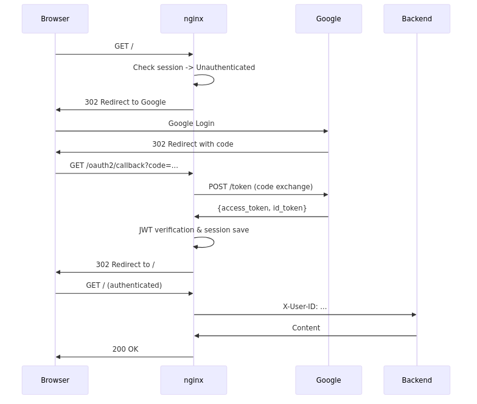

# Configuration Examples

A collection of quick start instructions and practical configuration examples for the nginx OIDC module, covering various use cases.

## Quick Start

This section explains how to get the module running with a minimal configuration.

### Minimal Configuration

The following is a minimal configuration example using Google as the OIDC provider:

```nginx
http {
    # Session store definition (recommended: if omitted, a default memory store is automatically created)
    oidc_session_store memory_store {
        type memory;
        size 10m;
        ttl 3600;
    }

    # OIDC provider definition (required)
    oidc_provider google {
        issuer "https://accounts.google.com";
        client_id "your-client-id.apps.googleusercontent.com";
        client_secret "your-client-secret";
        redirect_uri "/oauth2/callback";
    }

    server {
        listen 80;
        server_name myapp.example.com;

        # Enable authentication for the entire server
        auth_oidc google;

        location / {
            proxy_pass http://backend;
            proxy_set_header X-User-ID $oidc_claim_sub;
        }

        # OIDC HTTP fetch proxy (required boilerplate: copy and use as-is)
        location /_oidc_http_fetch {
            internal;
            resolver 127.0.0.53 valid=300s;
            resolver_timeout 5s;
            auth_oidc off;

            proxy_pass $oidc_fetch_url;
            proxy_method $oidc_fetch_method;
            proxy_set_header Content-Type $oidc_fetch_content_type;
            proxy_set_header Content-Length $oidc_fetch_content_length;
            proxy_set_header Authorization $oidc_fetch_bearer;

            proxy_set_header Host $proxy_host;
            proxy_set_header Accept-Encoding "";
            proxy_pass_request_body on;
            proxy_max_temp_file_size 0;

            proxy_http_version 1.1;
            proxy_set_header Connection "";

            proxy_ssl_verify on;
            proxy_ssl_verify_depth 2;
            proxy_ssl_trusted_certificate /etc/ssl/certs/ca-certificates.crt;
            proxy_ssl_server_name on;
            proxy_ssl_name $proxy_host;

            proxy_connect_timeout 30s;
            proxy_send_timeout 30s;
            proxy_read_timeout 30s;
        }
    }
}
```

**Required elements**:
1. `oidc_provider`: OIDC provider configuration (issuer and client_id are required. session_store can be omitted; when omitted, a default memory store is automatically created and used)
2. `auth_oidc`: Enables authentication (at server or location level)
3. `/_oidc_http_fetch`: Internal proxy location for external HTTP requests

**Recommended elements**:
- `oidc_session_store`: Store for saving session information (when omitted, the default behavior described above applies)

**Note**: The configuration example above specifies `ttl 3600` (1 hour), but the default value of `session_timeout` is 28800 seconds (8 hours). With the default values, `ttl` (1 hour) < `session_timeout` (8 hours), which violates the recommended setting (`ttl` >= `session_timeout`). As a result, even though the cookie is still valid, the server-side session expires first, causing re-authentication after 1 hour. For production environments, set `ttl` to be equal to or greater than `session_timeout` (e.g., `ttl 28800;` or reduce `session_timeout` to be equal to or less than `ttl`). See [SECURITY.md](SECURITY.md#session-timeout) for details.

### Verification

#### Step 1: Google OAuth 2.0 Client Setup

1. Create a project in [Google Cloud Console](https://console.cloud.google.com/)
2. Go to "APIs & Services" -> "Credentials" -> "Create Credentials" -> "OAuth client ID"
3. Application type: "Web application"
4. Authorized redirect URIs: `http://myapp.example.com/oauth2/callback`
5. Obtain the Client ID and Client Secret

#### Step 2: Edit the Configuration File

Write the minimal configuration example above to `/etc/nginx/nginx.conf` and replace the following:
- `your-client-id.apps.googleusercontent.com`: Your obtained Client ID
- `your-client-secret`: Your obtained Client Secret
- `myapp.example.com`: Your actual server name
- `http://backend`: Your backend server URL
- `127.0.0.53`: DNS resolver appropriate for your environment

#### Step 3: Validate the Configuration

```bash
nginx -t
```

Verify that there are no errors.

#### Step 4: Start/Reload nginx

```bash
# For a fresh start
nginx

# Reload after configuration changes
nginx -s reload
```

#### Step 5: Verify Operation

1. Access `http://myapp.example.com/` in a browser
2. Verify that you are redirected to the Google login screen
3. Log in with a Google account
4. Verify that you are redirected back to the original URL and backend content is displayed

#### Authentication Flow Diagram



**Troubleshooting**:
- If a redirect loop occurs: Verify that `auth_oidc off;` is set on the `/_oidc_http_fetch` location
- If DNS errors occur: Change the `resolver` setting to match your environment
- If SSL errors occur: Verify the `proxy_ssl_trusted_certificate` path

## Use Case Configuration Examples

This section provides practical configuration examples for various use cases.

### Basic Configuration with Memory Store

This example extends the [Minimal Configuration](#minimal-configuration) by adding a public endpoint and additional header settings.

**Note**: The following is an excerpt of the server block. A complete configuration requires `oidc_session_store`, `oidc_provider`, and the `/_oidc_http_fetch` location (see [Minimal Configuration](#minimal-configuration)).

```nginx
server {
    listen 80;
    server_name myapp.example.com;

    # Enable authentication for the entire server
    auth_oidc google;

    location / {
        proxy_pass http://backend;
        proxy_set_header X-User-ID $oidc_claim_sub;
        proxy_set_header X-User-Email $oidc_claim_email;
    }

    # Public endpoint (no authentication required)
    location /public {
        auth_oidc off;
        proxy_pass http://backend;
    }

    # /_oidc_http_fetch is the same as in the minimal configuration (omitted)
}
```

### Production Configuration with Redis Store

A production-oriented configuration using an enterprise IdP and Redis.

```nginx
http {
    # Define Redis session store
    oidc_session_store redis_store {
        type redis;
        hostname "redis.example.com";
        port 6379;
        database 0;
        password "your-redis-password";
        connect_timeout 5000ms;
        command_timeout 5000ms;
        ttl 28800;
        prefix "oidc:session:";
    }

    # Define enterprise IdP provider
    oidc_provider corporate_idp {
        issuer "https://idp.example.com";
        client_id "webapp-client";
        client_secret "secret";
        session_store redis_store;
        redirect_uri "https://app.example.com/oauth2/callback";

        # Security settings
        pkce on;
        code_challenge_method S256;

        # Enable UserInfo retrieval
        userinfo on;

        # Session settings
        session_timeout 28800;  # 8 hours

        # Logout settings
        logout_uri "/logout";
        post_logout_uri "https://app.example.com/";
        logout_token_hint on;
    }

    server {
        listen 443 ssl http2;
        server_name app.example.com;

        ssl_certificate /path/to/cert.pem;
        ssl_certificate_key /path/to/key.pem;

        # Require authentication by default
        auth_oidc corporate_idp;

        location / {
            proxy_pass http://backend;
            proxy_set_header X-ID-Token $oidc_id_token;
            proxy_set_header X-Access-Token $oidc_access_token;
            proxy_set_header X-User-ID $oidc_claim_sub;
            proxy_set_header X-UserInfo $oidc_userinfo;
        }

        # Status endpoint (admin only)
        location /oidc_status {
            auth_oidc off;
            oidc_status;
            allow 10.0.0.0/8;
            deny all;
        }

        # OIDC HTTP fetch proxy (required)
        location /_oidc_http_fetch {
            internal;
            resolver 10.0.0.1 10.0.0.2 valid=300s;
            resolver_timeout 5s;
            auth_oidc off;

            proxy_pass $oidc_fetch_url;
            proxy_method $oidc_fetch_method;
            proxy_set_header Content-Type $oidc_fetch_content_type;
            proxy_set_header Content-Length $oidc_fetch_content_length;
            proxy_set_header Authorization $oidc_fetch_bearer;

            proxy_set_header Host $proxy_host;
            proxy_set_header Accept-Encoding "";
            proxy_pass_request_body on;
            proxy_max_temp_file_size 0;

            proxy_http_version 1.1;
            proxy_set_header Connection "";

            proxy_ssl_verify on;
            proxy_ssl_verify_depth 2;
            proxy_ssl_trusted_certificate /etc/ssl/certs/ca-certificates.crt;
            proxy_ssl_server_name on;
            proxy_ssl_name $proxy_host;

            proxy_connect_timeout 30s;
            proxy_send_timeout 30s;
            proxy_read_timeout 30s;
        }
    }
}
```

### Multiple Providers Configuration

A configuration supporting both Google and Azure AD. See [Minimal Configuration](#minimal-configuration) for notes about the default values of the session store `ttl` and the provider `session_timeout`.

**Warning**: When running multiple providers on the same server, configure a different `cookie_name` for each provider. Using the same cookie name will cause session conflicts and prevent normal operation.

**Note**: Callback URIs (e.g., `/auth/google/callback`) do not need to be explicitly matched to a location with `auth_oidc` enabled. The OIDC module automatically detects and processes callbacks based on the callback cookie and request URI. However, note that all OIDC processing including callback detection is disabled in locations where `auth_oidc off;` is explicitly set, so ensure that callback URIs do not match such locations.

```nginx
http {
    # Shared session store
    oidc_session_store shared_store {
        type redis;
        hostname "127.0.0.1";
        port 6379;
    }

    # Google provider
    oidc_provider google {
        issuer "https://accounts.google.com";
        client_id "google-client-id";
        client_secret "google-client-secret";
        session_store shared_store;
        redirect_uri "/auth/google/callback";
        cookie_name "oidc_google_session";
    }

    # Azure AD provider
    oidc_provider azure {
        issuer "https://login.microsoftonline.com/tenant-id/v2.0";
        client_id "azure-client-id";
        client_secret "azure-client-secret";
        session_store shared_store;
        redirect_uri "/auth/azure/callback";
        cookie_name "oidc_azure_session";
    }

    server {
        listen 80;

        # Google authentication endpoint
        location /google {
            auth_oidc google;
            proxy_pass http://backend;
        }

        # Azure AD authentication endpoint
        location /azure {
            auth_oidc azure;
            proxy_pass http://backend;
        }

        # OIDC HTTP fetch proxy (required)
        location /_oidc_http_fetch {
            internal;
            resolver 127.0.0.53 valid=300s;
            resolver_timeout 5s;
            auth_oidc off;

            proxy_pass $oidc_fetch_url;
            proxy_method $oidc_fetch_method;
            proxy_set_header Content-Type $oidc_fetch_content_type;
            proxy_set_header Content-Length $oidc_fetch_content_length;
            proxy_set_header Authorization $oidc_fetch_bearer;

            proxy_set_header Host $proxy_host;
            proxy_set_header Accept-Encoding "";
            proxy_pass_request_body on;
            proxy_max_temp_file_size 0;

            proxy_http_version 1.1;
            proxy_set_header Connection "";

            proxy_ssl_verify on;
            proxy_ssl_verify_depth 2;
            proxy_ssl_trusted_certificate /etc/ssl/certs/ca-certificates.crt;
            proxy_ssl_server_name on;
            proxy_ssl_name $proxy_host;

            proxy_connect_timeout 30s;
            proxy_send_timeout 30s;
            proxy_read_timeout 30s;
        }
    }
}
```

### auth_oidc_mode Usage Examples

A configuration that demonstrates different authentication modes. See [Minimal Configuration](#minimal-configuration) for notes about the default values of the session store `ttl` and the provider `session_timeout`.

```nginx
http {
    oidc_session_store memory_store {
        type memory;
        size 10m;
    }

    oidc_provider my_provider {
        issuer "https://accounts.example.com";
        client_id "my-client-id";
        client_secret "my-client-secret";
        session_store memory_store;
        redirect_uri "/oidc_callback";
    }

    server {
        listen 80;
        server_name myapp.example.com;

        # Set when the external URL is HTTPS in a reverse proxy environment
        oidc_base_url "https://myapp.example.com";

        # Default is optional authentication
        auth_oidc my_provider;
        auth_oidc_mode verify;

        # Top page (inherits optional authentication)
        location / {
            proxy_pass http://frontend;
            # Pass user info only when authenticated
            proxy_set_header X-User-ID $oidc_claim_sub;
        }

        # Admin area (overridden to require authentication)
        location /admin {
            auth_oidc_mode require;
            proxy_pass http://admin_backend;
            proxy_set_header X-User-ID $oidc_claim_sub;
        }

        # API endpoint (overridden to disable authentication)
        # auth_oidc_mode off: Provider is inherited but authentication processing is skipped
        #   -> $oidc_authenticated is "0", other $oidc_* variables are empty
        location /api/public {
            auth_oidc_mode off;
            proxy_pass http://api_backend;
        }

        # Public content (authentication completely disabled)
        # auth_oidc off: Disables the provider itself (OIDC module does not process)
        #   -> Like auth_oidc_mode off, $oidc_authenticated is "0" and
        #     other $oidc_* variables are empty, but the provider association
        #     itself is dissociated
        location /public {
            auth_oidc off;
            root /var/www/public;
        }

        # Static files (authentication disabled)
        location /static {
            auth_oidc_mode off;
            root /var/www/static;
        }

        # OIDC HTTP fetch proxy (required)
        location /_oidc_http_fetch {
            internal;
            resolver 127.0.0.53 valid=300s;
            resolver_timeout 5s;
            auth_oidc off;

            proxy_pass $oidc_fetch_url;
            proxy_method $oidc_fetch_method;
            proxy_set_header Content-Type $oidc_fetch_content_type;
            proxy_set_header Content-Length $oidc_fetch_content_length;
            proxy_set_header Authorization $oidc_fetch_bearer;

            proxy_set_header Host $proxy_host;
            proxy_set_header Accept-Encoding "";
            proxy_pass_request_body on;
            proxy_max_temp_file_size 0;

            proxy_http_version 1.1;
            proxy_set_header Connection "";

            proxy_ssl_verify on;
            proxy_ssl_verify_depth 2;
            proxy_ssl_trusted_certificate /etc/ssl/certs/ca-certificates.crt;
            proxy_ssl_server_name on;
            proxy_ssl_name $proxy_host;

            proxy_connect_timeout 30s;
            proxy_send_timeout 30s;
            proxy_read_timeout 30s;
        }
    }
}
```

### UserInfo Retrieval Configuration

A configuration for retrieving additional information from the UserInfo endpoint.

**Note**: The following is an excerpt of the provider and server blocks. A complete configuration requires `oidc_session_store` and the `/_oidc_http_fetch` location (see [Basic Configuration with Memory Store](#basic-configuration-with-memory-store)).

```nginx
oidc_provider my_provider {
    issuer "https://accounts.example.com";
    client_id "my-client-id";
    client_secret "my-client-secret";
    session_store memory_store;
    redirect_uri "/oauth2/callback";

    # Enable UserInfo retrieval
    userinfo on;

    # Request profile and email scopes
    scopes openid profile email;
}

server {
    auth_oidc my_provider;

    location / {
        proxy_pass http://backend;

        # Set information retrieved from UserInfo as headers
        proxy_set_header X-User-Sub $oidc_claim_sub;
        proxy_set_header X-User-Email $oidc_claim_email;
        proxy_set_header X-User-Name $oidc_claim_name;
        proxy_set_header X-User-Given-Name $oidc_claim_given_name;
        proxy_set_header X-User-Family-Name $oidc_claim_family_name;
        proxy_set_header X-UserInfo-JSON $oidc_userinfo;
    }
}
```

### RP-Initiated Logout Configuration

A configuration for logout processing in coordination with the OIDC provider.

**Note**: The following is an excerpt of the provider and server blocks. A complete configuration requires `oidc_session_store` and the `/_oidc_http_fetch` location (see [Basic Configuration with Memory Store](#basic-configuration-with-memory-store)).

```nginx
oidc_provider my_provider {
    issuer "https://accounts.example.com";
    client_id "my-client-id";
    client_secret "my-client-secret";
    session_store memory_store;
    redirect_uri "/oauth2/callback";

    # RP-Initiated Logout settings
    logout_uri "/logout";
    post_logout_uri "https://myapp.example.com/goodbye";
    logout_token_hint on;
}

server {
    auth_oidc my_provider;

    location / {
        proxy_pass http://backend;
    }

    # Logout endpoint
    # The OIDC module automatically determines if the request URI matches logout_uri.
    # When matched, it automatically performs session deletion and logout redirect
    # to the OIDC provider, so no additional configuration is needed in the location block.
    # (auth_oidc my_provider must be inherited from the server level)
    location /logout {
        # The OIDC module automatically handles logout processing, no additional configuration needed
    }

    # Post-logout landing page
    location /goodbye {
        auth_oidc off;
        return 200 "Logged out successfully.";
    }
}
```

## Related Documents

- [README.md](../README.md): Module overview
- [DIRECTIVES.md](DIRECTIVES.md): Directive and variable reference
- [INSTALL.md](INSTALL.md): Installation guide (prerequisites, build instructions)
- [SECURITY.md](SECURITY.md): Security considerations (PKCE, HTTPS, cookie security, etc.)
- [TROUBLESHOOTING.md](TROUBLESHOOTING.md): Troubleshooting (common issues, log inspection)
- [JWT_SUPPORTED_ALGORITHMS.md](JWT_SUPPORTED_ALGORITHMS.md): JWT supported algorithms
- [COMMERCIAL_COMPATIBILITY.md](COMMERCIAL_COMPATIBILITY.md): Commercial version compatibility
